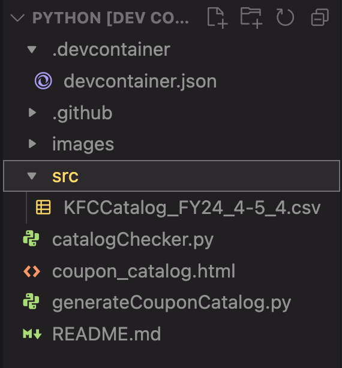
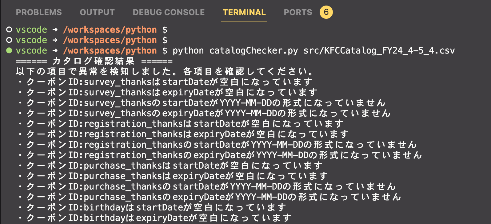
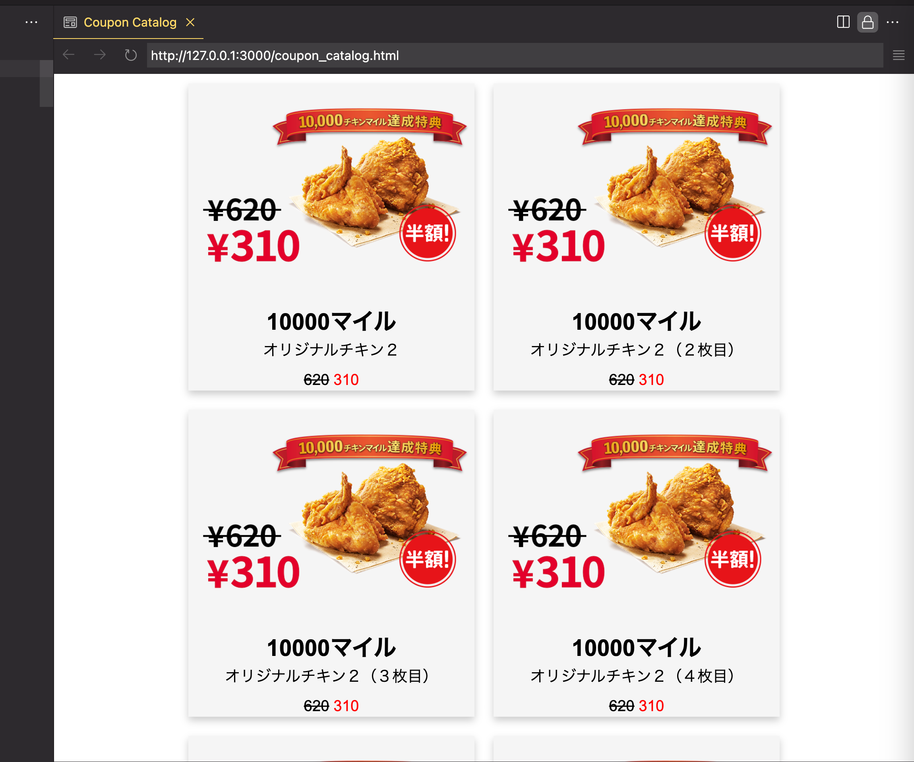

# README

本システムはBrazeにアップロードするCSV形式のCatalogの事前検査を目的とします。  
検査機能は大きく分けて２つあり、  
[catalogChecker.py]にてCSVの内容を検査し、  
[generateCouponCatalog.py]にてHTMLファイルを出力し、目視によるイメージ図とクーポン内容の確認を行うものです。

## catalogCheckerによる検査項目
2024年5月時点で以下の検査項目に対応しています。  
このチェッカーはカタログ確認結果が「カタログは正常に記入されています」と表示されるまで繰り返し実行してください。

・idに空白がないか  
・couponNameに空白がないか  
・couponDescriptionに空白がないか  
・(Stageクーポン以外で)imageUrlに空白がないか  
・(Stageクーポン以外で)imageUrlに誤りがないか  
・startDateTime半角スペースが含まれていないか  
・endDateTimeに半角スペースが含まれていないか  
・startDateに半角スペースが含まれていないか  
・expiryDateに半角スペースが含まれていないか  
・startDateTime全角スペースが含まれていないか  
・endDateTimeに全角スペースが含まれていないか  
・startDateに全角スペースが含まれていないか  
・expiryDateに全角スペースが含まれていないか  
・startDateTimeがendDateTimeより大きくなっていないかを確認  
・startDateがexpiryDateより後の日付になっていないかを確認  
・startDateがYYYY-MM-DDの形式になっているか  
・expiryDateがYYYY-MM-DDの形式になっているか  
・(有効なStageクーポンにおいて)startDateが空白となっていないか  
・(有効なStageクーポンにおいて)expiryDateが空白となっていないか  
・(有効なStageクーポンにおいて)startDateTimeが空白となっていないか  
・(有効なStageクーポンにおいて)endDateTimeが空白となっていないか  
・(空白以外で)expiredDateとendDateTimeの値が同一であるか  
・(空白以外で)startDateTimeとstartDateは同一の日付であるか  
・(空白以外で)endDateTimeとexpiryDateは同一の日付であるか  
・(空白以外で)couponCodeの文字列がpromotionIdに含まれているか  
　(normalPrice/discountPriceが空白の場合もあるので以下は機能を無効化)  
~~・(有効なクーポンにおいて)normalPriceが空白でないか~~  
~~・(有効なクーポンにおいて)discountPriceが空白でないか~~  
~~・(有効なクーポンにおいて)discountPriceがnormalPriceより大きくなっていないか~~  
・(有効なクーポンにおいて)contentCardCategoryがcouponとなっているか  
・(Stageクーポン以外で)promotionIdの中にidと同じ文字列があるか  
・(Stageクーポンで)promotionIdの中にidと同じステージ情報があるか  
・(10000マイルクーポン、アンケートサンクスクーポン、会員登録サンクスクーポン、購入サンクスクーポンにおいて)couopnTypeがcontentsCardとなっているか  

## catalogCheckerによる検査項目  
・(有効なクーポンにおいて)Renegade APIを実行し、クーポンが付与できることを確認する  

## generateCouponCatalogによる確認項目
クーポンをカード形式で表示し、以下の項目の確認が行えます。

・画像イメージの正当性  
・画像イメージとクーポン名に差異がないか  
・画像イメージとクーポン説明に差異がないか  
・クーポン名とクーポン説明に差異がないか  
・startDateTimeを表示  
・endDateTimeを表示  
・startDateを表示 
・expiryDateを表示 

## 事前準備

[Docker環境の場合]  
1. VSCodeをインストール  
2. VScodeの格納機能であるDev Containersをインストール  
3. Dockerデスクトップをインストールし、起動させておく  
   [Docker Desktop for Windows](https://docs.docker.com/desktop/install/windows-install/)

   [Docker Desktop for mac](https://docs.docker.com/desktop/install/mac-install/)  

4. ダウンロードしたファイル(catalogChecker-main_1.1.zip)を解凍し、  
VSCodeで**フォルダを**開く  
   ※フォルダから開かないと、Dockerコンテナを開けないため注意！
　　
5. Command ＋Shipt ＋P でコマンドパレットを開く  
下記を入力し、チェッカー用のdockerコンテナを開く。  
  `Dev Containers: Reopen in Container`
6. VSCode左下に[開発コンテナー]の文字が入れば、環境構築OK

   ※なお、チェッカー用のdockerコンテナを閉じる場合は下記を入力。  
  　`Remote-Containers: Close Remote Connection`

[ローカル環境の場合]  
1. Pythonをインストール   
   以下のサイトよりPython3系をインストールしてください。  
<https://www.python.org/downloads/>

2. インストール後はターミナルで以下のコマンドを実行し、Pythonのインストール状況を確認してください。  
   `python3 --version`

3. ターミナルで以下のコマンドを実行し、pipのインストール状況を確認してください。  
   `pip --version`  
4. ターミナルで以下のコマンドを実行し、必要なライブラリをインストールしてください。  
   `pip install requests`
4. ダウンロードしたファイル(CatalogChecker_ver1.x.zip)を解凍し、ターミナルで実行できるようにする。

## catalogChecker.pyの実行方法

1. srcフォルダ配下にCSV形式のCoupon Catalogを配置  
   
2. VSCodeのTERMINALにて [python catalogChecker.py src/{CSVFileName}]を実行  
   例 : python catalogChecker.py src/KFCCatalog.csv  
   ※ TERMINALはCtrl + J で表示されるようになります。(macはCommande + J)

3. TERMINALにて検査結果を確認する  
      

## generateCouponCatalog.pyの実行方法

1. srcフォルダ配下にCSV形式のCoupon Catalogを配置

2. VSCodeのTERMINALにて [python generateCouponCatalog.py src/{CSVFileName}]を実行  
   例 : python generateCouponCatalog.py src/KFCCatalog.csv  
   ※ TERMINALはCtrl + J で表示されるようになります。(macはCommande + J)

3. coupon_catalog.html が生成されたことを確認

4. coupon_catalog.html を開き、画面右上にある[Open Preview]を選択  
      

5. Preview画面にてクーポンCatalogの確認をする  
      

※ローカル環境だと、ユニックスタイムで入力した時間が、日本のタイムゾーン分ずれます（+9時間）  
※ローカル環境で各Pythonを実行する場合は`python3`で実行
